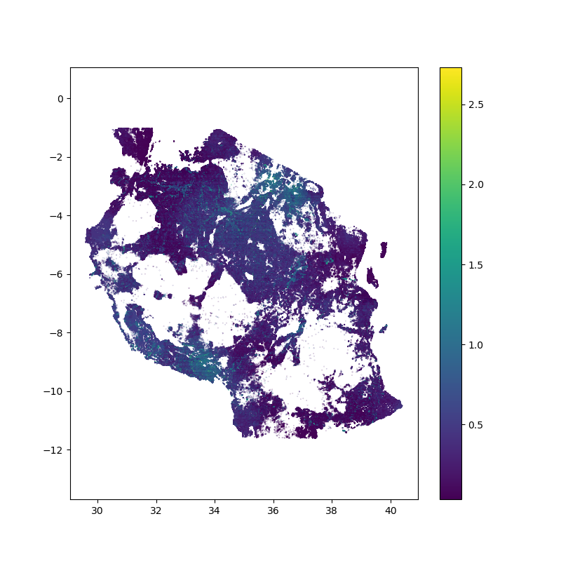

.. GitLab Pages with Sphinx documentation master file, created by
   sphinx-quickstart on Thu Jan  9 10:28:38 2020.
   You can adapt this file completely to your liking, but it should at least
   contain the root `toctree` directive.

Welcome to the TOMRAP documentation pages
====================================================

Tool for Multi-hazard Risk Assessment in Python
------------------------------------------------

The project builds on outputs from the METEOR project (NEE6423R) to generate a tool that can be used in future projects to assess multi-hazard risk. The METEOR model was initially developed in ArcGIS. By streamlining this code in Python we will make multi-hazard risk analysis faster and more widely applicable.

*Sample output of a hazard map produced from combining different risk factors in Tanzania.*

|hmap_sample| 

_These documents are currently written from an Internal BGS perspective and are not yet for public release._

This software was developed from a Jupyter notebook by @kle (Kathryn Leeming) to take multiple spatial inputs (dbf, tifs) and combine them to create hazard vulnerability maps. Notebook was run from a directory containing copies of the files, original files are on W drive. The original notebooks are now archived in the ``notebooks`` directory in the repository linked below.

To submit issues, report bugs, or feature requests submit them at: https://kwvmxgit.ad.nerc.ac.uk/decval/hazardmaps

.. toctree::
   :maxdepth: 2
   :caption: Contents:

   installation
   quickrun
   configuring
   modeldetail

Fork this project
------------------

   - https://kwvmxgit.ad.nerc.ac.uk/kle/hazardmaps

