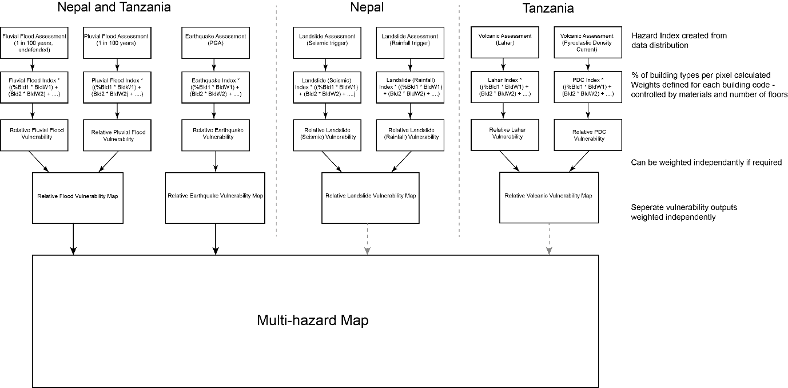

TOMRAP (METEOR) multihazard and exposure modelling
==================================================

Location of data for modelling
------------------------------

Tanzania
~~~~~~~~

Seismic:
``W:\teams\EPOM\METEOR\Data\WP6_Multihazard_impact\Data\Tanzania\Seismic``

Flooding:
``W:\teams\EPOM\METEOR\Data\WP6_Multihazard_impact\Data\Tanzania\Flooding\Version_2_Tanz``

Volcanic:
``W:\teams\EPOM\METEOR\Data\WP6_Multihazard_impact\Data\Tanzania\Volcanic_basins``

Exposure:
``W:\teams\EPOM\METEOR\Data\WP3_Exposure_Data\TZA_buildings_exposure_20200731.shp``

Nepal
~~~~~

Seismic:
``W:\teams\EPOM\METEOR\Data\WP6_Multihazard_impact\Data\Nepal\Seismic``

Flooding:
``W:\teams\EPOM\METEOR\Data\WP6_Multihazard_impact\Data\Nepal\Flooding\Version
2_nepal``

Landslide:
``W:\teams\EPOM\METEOR\Data\WP6_Multihazard_impact\Data\Nepal\SuscHazardMaps_Final``

Exposure:
``W:\teams\EPOM\METEOR\Data\WP3_Exposure_Data\Deliverable4_Nepal``

Original Arc GIS files
----------------------

Nepal:

``W:\teams\EPOM\METEOR\Data\WP6_Multihazard_impact\Multihazard_modelling\Modelling_2020\Final_outputs\Nepal``

Tanzania:

``W:\teams\EPOM\METEOR\Data\WP6_Multihazard_impact\Multihazard_modelling\Modelling_2020\Final_outputs\Tanzania``

In both Tanzania and Nepal follow the same instructions:

1) Identification of the inundation zone and inundation depth zones:
   Using the hazard footprints generated by BGS, GEM, FATHOM etc. Data
   is not comparable, so must generate an index to allow for later
   combination of data.

2) Identification of factors that affect the vulnerability of buildings
   and people and collection of data: In this case we have selected the
   criteria we can easily evaluate from the exposure data generated by
   ImageCat – building material and building height.

3) Calculation of the vulnerability of individual buildings within the
   inundation zone: Generated weights for each building types to express
   the potential vulnerability of individual buildings to a specific
   hazard. Earthquake – determined in agreement with GEM, Flooding –
   based on values from Kappes and discussed with FATHOM and ImageCat,
   Volcanic ash and pyroclastic flows – based on vulnerability curves
   from GEM and published literature (Neri et al., 2000; Simkin et al.,
   2001; Spence et al., 2007; Auker et al., 2013 and Blong et al., 2017)
   and Volcanic lahars – based on values from Kappes for debris flows.

4) Combine single hazard ‘relative vulnerability map’ to generate a
   multi-hazard vulnerability map – weighted to reflect hazard
   frequency.

|flowchart|

Step 1
~~~~~~

Create an index value of hazard data per pixel. Ideally on a 1 – 5
scale, where the thresholds are defined by the distribution of the data
(flood and earthquake).

Volcanic basins will need to be classified instead (high / medium /
low), but will need to be on a comparable scale:

**Volcanic Basins** – convert shapes to high / medium / low hazard

**Pyroclastic flow** – Basin; If the pixel falls within a pyroclastic
basin then assign High (5) to pixels within 0 – 15km of the summit,
Medium (3) 15km – 30km. If pixel does not fall within the pyroclastic
basin but does fall within 50km of the summit, assign Low (1).

**Lahar flow** – Basin; If the pixel falls within a lahar basin then
assign High (5) to pixels within 0 – 50 km of the summit, Medium (3)
50km – 100km. If pixel does not fall within the lahar basin but does
fall within 200km of the summit, assign Low (1).

**(Would it be possible to have an output here that generated the hazard
index maps?)**

Step 2
~~~~~~

For all exposure data calculate % of each building type per pixel.

Step 3
~~~~~~

Use the building categories assign the following vulnerability weights –
these need to be easily editable.

Building Type Weights Tables
--------------------------------

For the original building weights tables, for buildings in Tanzania and Nepal, refer to the ``Multihazard_model.doc`` file in the docs folder.

Calculating Multihazard Vulnerability
======================================

Tanzania
--------

Hazard Footprint Weight (HFW)
~~~~~~~~~~~~~~~~~~~~~~~~~~~~~

Fluvial: 0.5

Pluvial: 0.5

Earthquake – NA

Lahar: 0.45

Pf: 0.55

Apply these equations per pixel to the relevant hazard maps produced in
previous sections:

Flooding
~~~~~~~~

Fluvial: (HFW:0.5)*([HAZARD INDEX SCORE] \* ((%CR/LFM/HBET:1,3 \* 0.32)
+ (%CR/LFM/HBET:4,7 \*0.2) + (%CR/LFM/HBET:8,20 \* 0.12) +
(%CR/LFINF+DNO/HBET:1,3 \* 0.4) + (%CR/LFINF+DNO/HBET:4,7 \* 0.25) +
(%CR/LFINF+DNO/HBET:8,20 \* 0.15) + (%S*0.09) + (%MUR+CB99/HBET:1,3 \*
0.4) + (%MUR+CB99/HBET:4,7 \* 0.25) + (%W*0.8) + (%MATO/LN \* 0.56) +
(%MUR+ADO/HBET:1,3 \*0.56) + (%MUR+CL99*0.56) + (%MUR+STRUB \* 0.56) +
(%W+WWD \* 0.56))

+

Pluvial: (HFW:0.5)*( [HAZARD INDEX SCORE] \*((%CR/LFM/HBET:1,3 \* 0.32)
+ (%CR/LFM/HBET:4,7 \*0.2) + (%CR/LFM/HBET:8,20 \* 0.12) +
(%CR/LFINF+DNO/HBET:1,3 \* 0.4) + (%CR/LFINF+DNO/HBET:4,7 \* 0.25) +
(%CR/LFINF+DNO/HBET:8,20 \* 0.15) + (%S*0.09) + (%MUR+CB99/HBET:1,3 \*
0.4) + (%MUR+CB99/HBET:4,7 \* 0.25) + (%W*0.8) + (%MATO/LN \* 0.56) +
(%MUR+ADO/HBET:1,3 \*0.56) + (%MUR+CL99*0.56) + (%MUR+STRUB \* 0.56) +
(%W+WWD \* 0.56))

**= Relative flooding vulnerability map**

Earthquake
~~~~~~~~~~

Earthquake: [HAZARD INDEX SCORE]\* ((%CR/LFM/HBET:1,3 \* 0.12) +
(%CR/LFM/HBET:4,7 \*0.32) + (%CR/LFM/HBET:8,20 \* 0.16) +
(%CR/LFINF+DNO/HBET:1,3 \* 0.18) + (%CR/LFINF+DNO/HBET:4,7 \* 0.48) +
(%CR/LFINF+DNO/HBET:8,20 \* 0.24) + (%S*0.2) + (%MUR+CB99/HBET:1,3 \*
0.09) + (%MUR+CB99/HBET:4,7 \* 0.24) + (%W*0.09) + (%MATO/LN \* 0.3) +
(%MUR+ADO/HBET:1,3 \*0.3) + (%MUR+CL99*0.3) + (%MUR+STRUB \* 0.3) +
(%W+WWD \* 0.3))

**= Relative earthquake vulnerability map**

Volcanic
~~~~~~~~

Lahar: (HFW:0.45)*( [HAZARD INDEX SCORE]*((%CR/LFM/HBET:1,3 \* 0.06) +
(%CR/LFM/HBET:4,7 \*0.1) + (%CR/LFM/HBET:8,20 \* 0.06) +
(%CR/LFINF+DNO/HBET:1,3 \* 0.6) + (%CR/LFINF+DNO/HBET:4,7 \* 0.3) +
(%CR/LFINF+DNO/HBET:8,20 \* 0.18) + (%S*0.3) + (%MUR+CB99/HBET:1,3 \*
0.4) + (%MUR+CB99/HBET:4,7 \* 0.2) + (%W*1) + (%MATO/LN \* 1) +
(%MUR+ADO/HBET:1,3 \*1) + (%MUR+CL99*1) + (%MUR+STRUB \* 1) + (%W+WWD \*
1))

+

Pf: HFW(0.55)*( [HAZARD INDEX SCORE]\* ((%CR/LFM/HBET:1,3 \* 0.56) +
(%CR/LFM/HBET:4,7 \*0.63) + (%CR/LFM/HBET:8,20 \* 0.7) +
(%CR/LFINF+DNO/HBET:1,3 \* 0.64) + (%CR/LFINF+DNO/HBET:4,7 \* 0.72) +
(%CR/LFINF+DNO/HBET:8,20 \* 0.8) + (%S*0.9) + (%MUR+CB99/HBET:1,3 \*
0.72) + (%MUR+CB99/HBET:4,7 \* 0.81) + (%W*0.08) + (%MATO/LN \* 0.8) +
(%MUR+ADO/HBET:1,3 \*0.8) + (%MUR+CL99*0.8) + (%MUR+STRUB \* 0.8) +
(%W+WWD \* 0.8))

**= Relative volcanic vulnerability map**

Weight vulnerability map outputs
~~~~~~~~~~~~~~~~~~~~~~~~~~~~~~~~

Vulnerability Map Weights (VMW)

Flood: 0.5

Eq: 0.35

Volcanic: 0.15

(Relative Flood vulnerability (please use 1 in 100 for now) \*
(VMW:0.5)) + (Relative Earthquake Vulnerability \* (VMW:0.35)) +
(Relative Volcanic Vulnerability \* (VMW:0.15))

**= Tanzania Multihazard vulnerability.**

Nepal
-----

Hazard Footprint Weight (HFW)
~~~~~~~~~~~~~~~~~~~~~~~~~~~~~

Fluvial: 0.5

Pluvial: 0.5

Earthquake – NA

Landslide - Rain: 0.5

Landslide - Eq: 0.5

Apply these equations to the relevant hazard maps produced in previous
sections:

Flooding
~~~~~~~~

Fluvial: (HFW:0.5)*([HAZARD INDEX SCORE] \* ((%CR/LFM/HBET:1,3 \* 0.32)
+ (%CR/LFM/HBET:4,7 \*0.2) + (%CR/LFM/HBET:8,20 \* 0.12) +
(%CR/LFINF+DNO/HBET:1,3 \* 0.4) + (%CR/LFINF+DNO/HBET:4,7 \* 0.25) +
(%CR/LFINF+DNO/HBET:8,20 \* 0.15) + (%S*0.09) + (%MUR+CB99/HBET:1,3 \*
0.4) + (%MUR+CB99/HBET:4,7 \* 0.25) + (%W*0.8) + (%MATO/LN \* 0.56) +
(%MUR+ADO/HBET:1,3 \*0.56) + (%MUR+CL99*0.56) + (%MUR+STRUB \* 0.56) +
(%W+WWD \* 0.56))

+

Pluvial: (HFW:0.5)*([HAZARD INDEX SCORE] \* ((%CR/LFM/HBET:1,3 \* 0.32)
+ (%CR/LFM/HBET:4,7 \*0.2) + (%CR/LFM/HBET:8,20 \* 0.12) +
(%CR/LFINF+DNO/HBET:1,3 \* 0.4) + (%CR/LFINF+DNO/HBET:4,7 \* 0.25) +
(%CR/LFINF+DNO/HBET:8,20 \* 0.15) + (%S*0.09) + (%MUR+CB99/HBET:1,3 \*
0.4) + (%MUR+CB99/HBET:4,7 \* 0.25) + (%W*0.8) + (%MATO/LN \* 0.56) +
(%MUR+ADO/HBET:1,3 \*0.56) + (%MUR+CL99*0.56) + (%MUR+STRUB \* 0.56) +
(%W+WWD \* 0.56)))

**= Relative flooding vulnerability map**

Earthquake
~~~~~~~~~~

Earthquake: [HAZARD INDEX SCORE]\* ((%CR/LFM/HBET:1,3 \* 0.12) +
(%CR/LFM/HBET:4,7 \*0.32) + (%CR/LFM/HBET:8,20 \* 0.16) +
(%CR/LFINF+DNO/HBET:1,3 \* 0.18) + (%CR/LFINF+DNO/HBET:4,7 \* 0.48) +
(%CR/LFINF+DNO/HBET:8,20 \* 0.24) + (%S*0.2) + (%MUR+CB99/HBET:1,3 \*
0.09) + (%MUR+CB99/HBET:4,7 \* 0.24) + (%W*0.09) + (%MATO/LN \* 0.3) +
(%MUR+ADO/HBET:1,3 \*0.3) + (%MUR+CL99*0.3) + (%MUR+STRUB \* 0.3) +
(%W+WWD \* 0.3))

**= Relative earthquake vulnerability map**

Landslide
~~~~~~~~~

Landslide - Rainfall: (HFW:0.5)*([HAZARD INDEX SCORE] \*
((%CR/LFM/HBET:1,3 \* 0.2) + (%CR/LFM/HBET:4,7 \*0.1) +
(%CR/LFM/HBET:8,20 \* 0.06) + (%CR/LFINF+DNO/HBET:1,3 \* 0.6) +
(%CR/LFINF+DNO/HBET:4,7 \* 0.3) + (%CR/LFINF+DNO/HBET:8,20 \* 0.18) +
(%S*0.3) + (%MUR+CB99/HBET:1,3 \* 0.4) + (%MUR+CB99/HBET:4,7 \* 0.2) +
(%W*0.3) + (%MATO/LN \* 0.6) + (%MUR+ADO/HBET:1,3 \*0.6) +
(%MUR+CL99*0.6) + (%MUR+STRUB \* 0.6) + (%W+WWD \* 0.6)))

+

Landslide - Eq: (HFW:0.5)*([HAZARD INDEX SCORE] \* ((%CR/LFM/HBET:1,3 \*
0.3) + (%CR/LFM/HBET:4,7 \*0.15) + (%CR/LFM/HBET:8,20 \* 0.09) +
(%CR/LFINF+DNO/HBET:1,3 \* 0.7) + (%CR/LFINF+DNO/HBET:4,7 \* 0.35) +
(%CR/LFINF+DNO/HBET:8,20 \* 0.21) + (%S*0.3) + (%MUR+CB99/HBET:1,3 \*
0.5) + (%MUR+CB99/HBET:4,7 \* 0.25) + (%W*0.3) + (%MATO/LN \* 0.7) +
(%MUR+ADO/HBET:1,3 \*0.7) + (%MUR+CL99*0.7) + (%MUR+STRUB \* 0.7) +
(%W+WWD \* 0.7)))

**= Relative landslide vulnerability map**

Weight vulnerability map outputs
~~~~~~~~~~~~~~~~~~~~~~~~~~~~~~~~

Vulnerability Map Weights (VMW)

Flood: 0.333

Eq: 0.333

Landslide: 0.333

(Relative Flood vulnerability (please use 1 in 100 for now) \*
(VMW:0.333)) + (Relative Earthquake Vulnerability \* (VMW:0.3333)) +
(Relative Landslide Vulnerability \* (VMW:0.333))

**= Nepal Multihazard vulnerability.**

Future items to implement
-------------------------

 - Monte carlo to look at the sensitivity to all weights

 - Single hazard index map

 - Exposure maps per building type – either number or % per pixel

 - Multihazard risk map

 - Extract multihazard risk per building type

After this I would like to experiment with having the weights be
defined by an exceedance probability curve, so they would be different
for every pixel. We could probably only do this for flood and seismic
and would need to somehow ‘look up’ the value from a collection of
vulnerability curves I have as .csv files – possibly for a smaller area
to start, but ideally at national scale eventually. This would mean that
the code would need to be able to read the original hazard values and
the index values when adding the weighted value, as the weight would be
defined by the original value but formulae would need the index value.
It might be as well to try this initially with the earthquake (or PGA
values), as I already have a collection of curves for the relevant
building types for this hazard. It would be interesting to know if there
would be a possibility to build in some functionality whereby users
could either set expert elicitation weightings or upload the
vulnerability curves that they have. I suppose that this would also mean
that the users would need to be able to control the number of building
types in their model run to match the number of building types that they
have.

Defining weights by vulnerability curve
----------------------------------------

This can now be done by supplying a separate vulnerability curve in the
form of a csv file. The csv file should be formatted with the first
column being the vulnerability multiplier, and the subsequent columns
along being the building type (header) and the mapped intensity values
below. In effect, this works as a lookup table, where the user specifies
a hazard intensity (in the config file) and then this value is used to
look-up the corresponding vulnerability multiplier, *per building type*.
The resulting lookup feature then gives a specific set of weights for a
given hazard intensity, which are combined into the pixel-by-pixel
hazard map (as in step 3 above [multihazard_model.docx]).

|vulncurve|

**Fig. User edits Hazard Intensity in the config file, then
multipliers/weights are returned by the program for each building type
(2 illustrated here).**

*Currently this has only been implemented with the earthquake data, as
we had vulnerability curves for the building types for these data (For
both Tanzania and Nepal). It would be possible to extend this further to
other data types, if other vulnerability curves are available in CSV
format for testing.*

