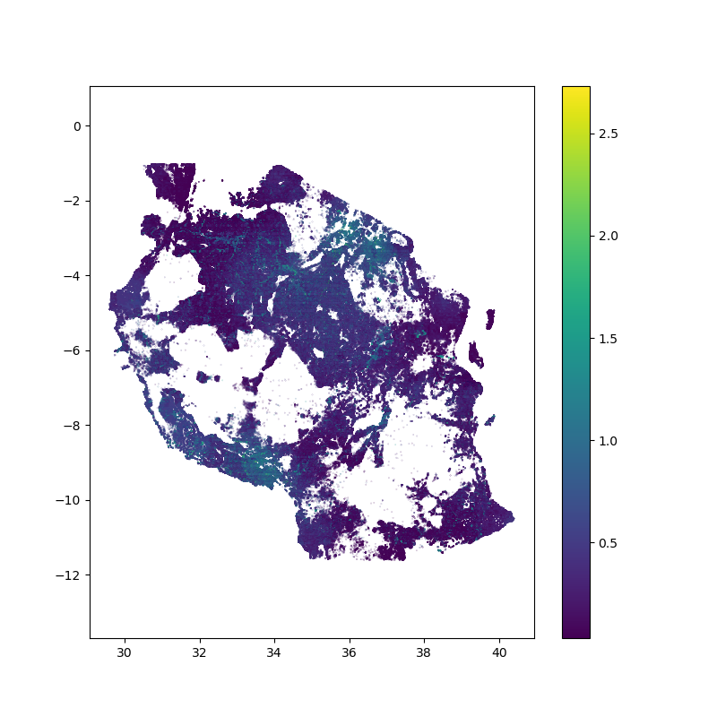

Quick Start Guide
==================

The hazard mapping program takes inputs from Flood Hazard Maps, Earthquake Risk Data, Volcanic Hazard Data, and
building style and size information to generate a series of multi-hazard risk maps. 

The program is written in Python and is run from the terminal or command line with the command:

.. code-block:: bash

    python hazardmap.py

This file is located in the ``hazardmap`` subdirectory of the top level repository folder.

The parameters and config settings are all read in from the ``config.py`` settings file in the ``hazardmap`` folder.

Data location
---------------

There are a large number of data files required to run the analysis, in the current version, these should be placed in the same location (all in the same folder). The location of this folder is specified in ``config.py`` under the ``DATADIR`` variable. 

You may place the data in a different location/drive, and symbolically link to the folder as well, if you are using linux/unix.

Config file
----------------

The config file is where the input file names, and other parameters are set. A working example is saved under ``config_tanzania.py`` - however - you should rename this to ``config.py`` when you wish to use it. This allows us to keep records/backups of the parameters for future model runs, e.g. ``config_nepal.py``, ``config_tanzania.py`` etc...

Creating links to config files
------------------------------

A workaround to avoid renaming the config.py file all the time is to create it as a *symbolic link* in Linux or shortcut in Windows. This way, config.py will always point to your actual config file. In linux you would do this with

.. code-block:: bash

    ln -s config.py config_tanzania.py

So now when the code is run, you do not need to change the contents of config.py - it already points to the config file of interest. To change the file, for example to run it against the Nepal parameters:

.. code-block:: bash

    rm config.py   # Remember it is only a link, not the file in this case!
    ln -s config.py config_nepal.py

and run the code as normal. This time, the Nepal paramters will be used.

Config file parameters
~~~~~~~~~~~~~~~~~~~~~~

Here is a brief description of the current  `config.py` parameters. Standard Python syntax is used, i.e. the parameter value is assigned using an `=` sign. Values can be strings (in quote marks), and some are lists: ``['item1', 'item2', ...etc]``. Truth values are set to either `True` or `False`. 

 - ``DATADIR``  - this is the base data directory. It should be a string. These can either be absolute or relative file paths in Windows or Unix format depending on the platform being used.

For the following input file names, I tend to use the baseline ``DATADIR`` and then append the file name to create a string, for example:

``exposure_file = DATADIR + "TZA_buildings_exposure_20200224.dbf"``

**Input Files**

 - ``exposure_file``  - Building exposure
 - ``exposure_breakdown_file``  - Building exposure breakdown/metadata
 - ``eearthquake_file``  -  Earthquake data
 - ``volcfile``  - Volcano data point data

**Parameters**

 - ``volcnames``  - a Python list of names of volcanoes in the Volcano shapefile (you would need to inspect the shapefile first or know the naming conventions used.)
 - ``floodratio``  -  A number that sets the interval of the flood ratios, e.g. 1 in 100 etc. 
 - ``floodtypes``  -  A list of strings that specifies the flood types to be used in the analysis. e.g. FU, FD, P
 - ``figure_prefix``  - a string that is appended to the start of the output figures (if required)
 - ``plot_types``  - a list of strings that specifies the types of plots that will be produced. The full list would be:

.. code-block:: bash

    plot_types = ["ear", "plu", "flu", "tep", "lahar", "pgaindx", "P", "FU", "lah", "pyr", "equ", "flood", "volc", "hmap"]

But if you simply wanted to make a single plot, you can pass a single string, e.g.:
 
.. code-block:: bash

    plot_types = "hmap"

 - ``building_type_tz``  -  This is a list of the building types and codes that correspond to the columns loaded from the buildings.dbf file. You would need to inspect this first to see what the column names are as they vary between datasets.

Vulnerability Curve inputs
---------------------------

It is possible to use custom vulnerability curves to determine the hazard multiplier for the hazard map generation. This means, given a user
specified hazard intensity set in the ``config.py`` file, this value is used to look up the corresponding damage multiplier in the csv file curve,
unique to each building type. The hazard risk for the relevant risk type is then based on the value found in the vulnerability curve in the final map.

Currently this is only available for Earthquakes.

To use this, in the ``config.py`` file, set the folllowing paramters:

.. code-block:: bash

    hazard_intensity = 2.0    # Used to lookup the damage multiplier 
    vuln_curve_file = "vuln_curve_tanzania.csv"

The vulnerability curve file is a plain text csv file with columns giving damage multiplier by building code type, and
rows giving the hazard intensity. The code is able to look-up the closest appropriate multiplier in the csv file,
so if you specify "2.0" as the hazard intensity, the code will automatically select, say, "2.12" if that happeneed to be the 
nearest matching value, so it is not necessary to know the exact values of hazard intensity, as long as your input value
is within the range of intensities given in the input file.
 
Outputs
-------

A full set of example outputs can be found in the ``plots`` folder in this repository. The final hazard map (``hmap``) should look something like this:

|hmap_sample| 

At the moment, further customisation is possible via editing hazardmap.py

