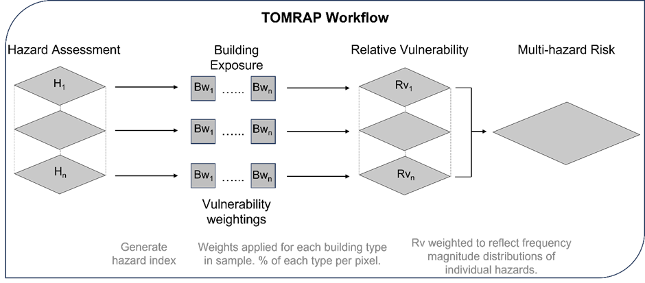

# Summary

Multi-hazards are defined as the major multiple hazards that an area might face and the specific context in which they occur, which may be simultaneously, cascadingly, or cumulatively through time (UNDRR, 2017). TOMRAP is an open-source python toolbox capable of generating a compounding / coincident multi-hazard risk assessment at national scale, incorporating any available hazard and exposure data with user defined weighting factors to reflect the changing vulnerability of building stock to various hazards. 

Globally these individual and interrelated hazards have the potential to result in large socio-economic losses (Tilloy et al., 2019). There are many approaches that have been developed to assess single hazards (e.g. Biass et al., 2016; Connor et al., 2017; Giardini et al., 1999; Lari et al., 2014; Sampson et al., 2015; Schilling, 1998; Sheirdan et al., 2005; Strauch et al., 2019 – and many others). These approaches vary, but fundamentally they attempt to quantify the nature, intensity and return period of specific hazards. Each single hazard has a different standardised unit of measurement for magnitude and it is this lack of common standardisation that can make multi-hazard assessments complex (Kappes et al., 2012a). In practice multi-hazard assessments are complicated by the differences between hazard characteristics and therefore the methods used to analyse them and that the impacts on exposure can be different for differing hazards and occasionally opposing (Kappes et al., 2012a). 

# Statement of need

There is a growing body of literature highlighting the need to move from single risk to multihazard risk assessment (for example: Kappes et al., 2012a; Gill and Malamund, 2016; Zschau, 2017; Ciurean et al., 2018; Tilloy et al., 2019; De Angeli et al., 2022; Ward et al., 2022). Past studies have investigated a range of potential methods for modelling these interactions, from purely qualitative to purely quantitative approaches. These include tools such as: Hazard Wheels (Rosendahl Appelquist and Halsnæs, 2015), Hazard Matrices (Gill and Malamund, 2014, Kappes et al., 2012a), Hazard / Risk Indices (Kappes et al., 2012b) and Probabilistic frameworks (Mignan et al., 2014). With more quantitative models requiring increasingly dense inventories of events to support the appropriate level of statistical analysis.
As part of the IPP funded METEOR project we developed a framework for modelling multihazard risk, which aggregates hazard, building exposure and vulnerability data to produce a national level semi-quantitative risk assessment.  This framework allows the aggregation of various probabilistic and inventory-based susceptibility and hazard assessments (for earthquake, volcano, flood and landslide), with satellite derived building exposure data and an assessment of building vulnerability, defined either by the input of fragility failure curves or through expertly elicited weighting factors.  This methodology can therefore be adapted dependant on what data is available to the end users and can be pushed to either a more qualitative or more quantitative output, as the data supports.

# Modelling Multihazard Risk

TOMRAP is a modelling toolbox written in Python that: 1) Creates an index value to allow for the combination of hazard footprints for 4 natural hazards, 2) Identifies the factors that affect the exposure and vulnerability of buildings to these specific hazards, 3) Calculates the vulnerability of individual buildings within hazard zones, 4) Applies weights for each building type to express the potential vulnerability of individual buildings to a specific hazard to generate relative single hazard vulnerability maps and then 5) Combines these single hazard ‘relative vulnerability maps’ to generate a multi-hazard vulnerability map which is weighted to reflect single hazard frequency / magnitude relationships. The basic structure of the modelling framework can be seen in \autoref{fig:Flowchart}.

The hazard map for a particular location, i, is a sum over individual hazards and can be defined as such:

[EQUATION 1]

where the map value for each hazard is given by: 

[EQUATION 2]

Where: $H_i$ is the final hazard map at location _i_, _K_ is the set of hazards combined in the final map, for example volcanic, seismic and flooding, $\Beta_k$ is the weight of hazard _k_, where $\Sigma_{k \in K}\Beta_{k} = 1$, $h_{ki}$ is the value of the hazard _k_ at location _i_, $L_k$ is the set of sub-classes within a hazard, for example pluvial and fluvial flooding. (If a hazard does not have sub-classes $L_k$ only has one entry and the sum is over one class), $\alpha_l$  is the weight of sub-class _l_, where  $\Sigma_{l \in L_k} \alpha_l = 1$, $g_{li}$ is the hazard index for sub-class _l_ at location _i_, _M_ is the set of building classes, for example "CR/LFM/HBET:1,3", "S", $\gamma_{ml}$ is the building weight for building class _m_ and sub-class _l_, $b_{mi}$ is the proportion of building type m at location _i_, where $\Sigma_{m \in M}b_{mi} =  1$ for all locations _i_.

The TOMRAP software package is released under an open source licence and distributed via GitHub. The interface to the software is via running a command line script that invokes the TOMRAP code, and a config file supplied allows the user to configure the input data sources, and any weighting factors. The sofware can also be configured to calculate weighting factors for hazards based on the user supplying vulnerability curve data (\autoref{fig:Vuln_curve}) The config file also allows the user to determine which output figures are produced from the analysis. (E.g. \autoref{fig:Tanzania})

TOMRAP was designed to be used by decision makers and stakeholders who are responsible for pre-positioning of resources prior to a disaster event and for those who are assessing the potential efficacy of interventions such as adapting building codes. The products from this toolbox are intended to provide guidance on the relative risk from multihazards at a national scale. It is important to note that any uncertainty associated with the input datasets is likely to be compounded by the aggregation of data within the model. It is therefore important to bear in mind that any data generated by this tool should be assessed for uncertainty. Methodologies for this are outlined in the publications attributed to the METEOR project (ref). Risk products generated by this tool should not be consider absolute risk assessments but rather a measure of the relative risk of areas in the context of specific natural hazards.

# References

Example of citing the `Astropy` package [@astropy] (`astropy.units` and
`astropy.coordinates`).

# Citations

Citations to entries in paper.bib should be in
[rMarkdown](http://rmarkdown.rstudio.com/authoring_bibliographies_and_citations.html)
format.

If you want to cite a software repository URL (e.g. something on GitHub without a preferred
citation) then you can do it with the example BibTeX entry below for @fidgit.

For a quick reference, the following citation commands can be used:
- `@author:2001`  ->  "Author et al. (2001)"
- `[@author:2001]` -> "(Author et al., 2001)"
- `[@author1:2001; @author2:2001]` -> "(Author1 et al., 2001; Author2 et al., 2002)"

# Figures

Figures can be included like this:

and referenced from text using \autoref{fig:example}.

Figure sizes can be customized by adding an optional second parameter:
{ width=20% }

# Acknowledgements

We acknowledge contributions from

# References
